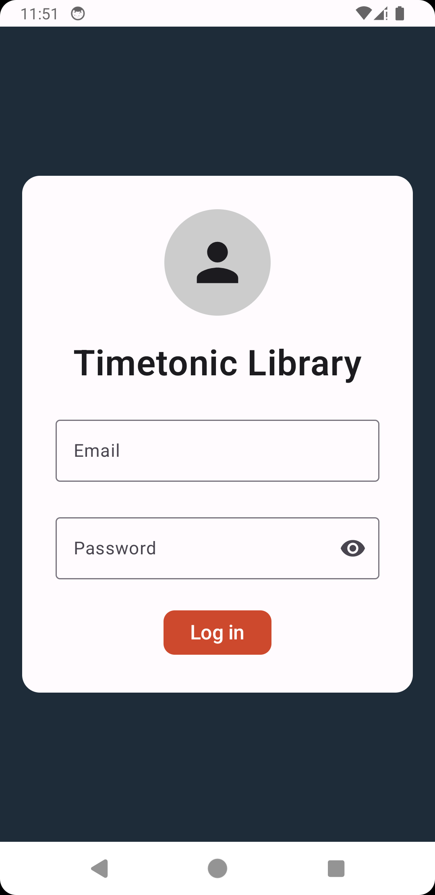
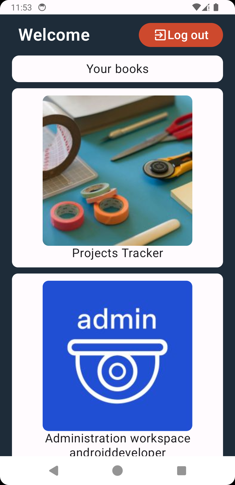

# Timetonic's library

This repository hosts an Android application built with modern Android development tools and practices. The app consists of two screens: a login screen and a landing page. It demonstrates the use of Jetpack Compose, Compose Navigation, Preferences DataStore, Retrofit, and Coil, following the DTO (Data Transfer Objects) and MVVM (Model-View-ViewModel) patterns.

## Features

- **Login Screen**: Authenticates the user against Timetonic's public API.
- **Landing Page**: Displays a list of book titles and their covers from the user's account.

<p align="center">
  
  
</p>

## Tech Stack

- **Jetpack Compose**: For building the UI.
- **Compose Navigation**: For handling in-app navigation.
- **Preferences DataStore**: For storing user preferences and authentication tokens.
- **Retrofit**: For making network requests.
- **Coil**: For loading and displaying images from the internet.

## Architecture

The application follows the MVVM (Model-View-ViewModel) architecture pattern, ensuring a clean separation of concerns and a robust structure for handling UI-related data. Data Transfer Objects are used to encapsulate the data retrieved from the API.

## Installation

To run the app, follow these steps:

1. Clone the repository:
    ```bash
    git clone https://github.com/Santiago15JM/TimetonicTest.git
    ```
2. Open the project in Android Studio.

3. Build and run the app on an emulator or a physical device.

## Usage

1. **Login**: Enter your credentials to authenticate with Timetonic's API.
2. **View Books**: Once logged in, you will be directed to the landing page, where you can see a list of book titles and covers from your account.

## Dependencies

The project uses the following dependencies:

- **Jetpack Compose**: [Compose](https://developer.android.com/jetpack/compose)
- **Compose Navigation**: [Navigation](https://developer.android.com/jetpack/compose/navigation)
- **Preferences DataStore**: [DataStore](https://developer.android.com/topic/libraries/architecture/datastore)
- **Retrofit**: [Retrofit](https://square.github.io/retrofit/)
- **Coil**: [Coil](https://coil-kt.github.io/coil/)
